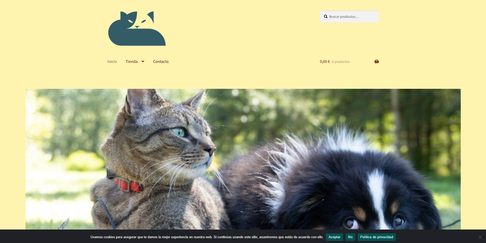
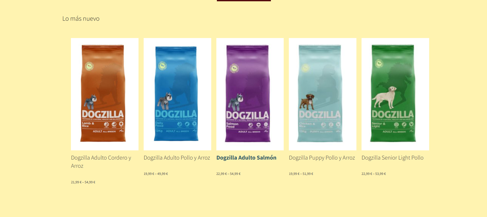
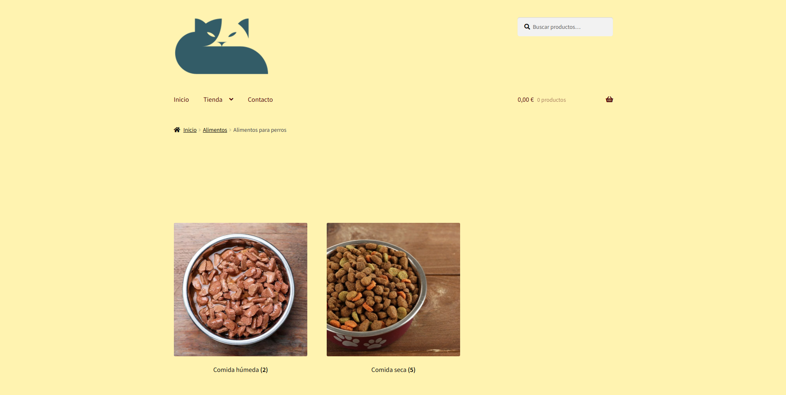
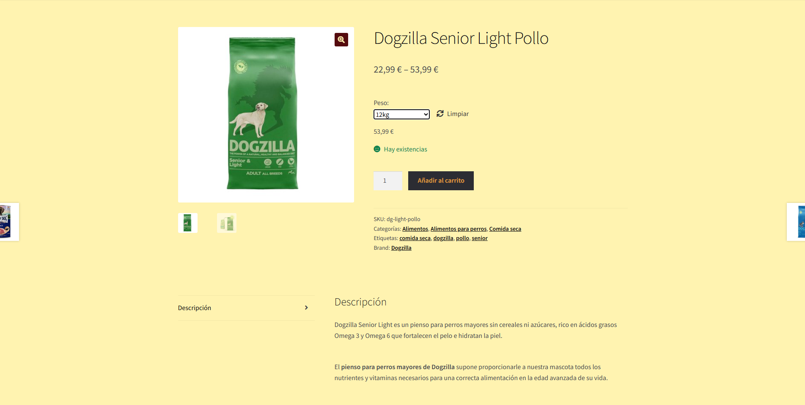
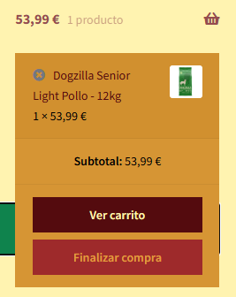
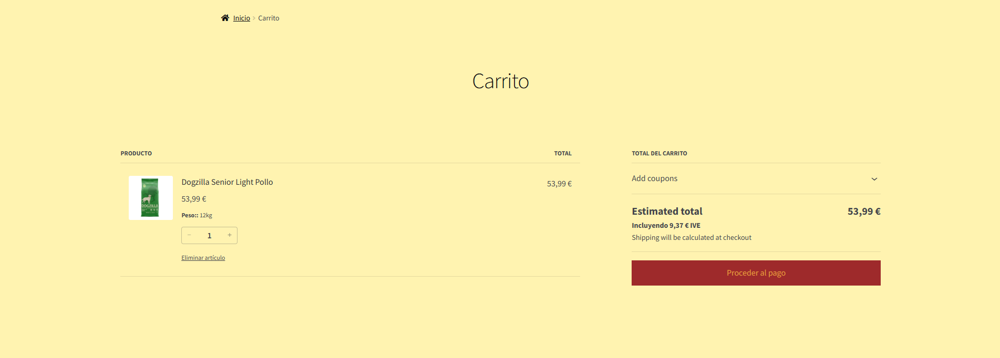
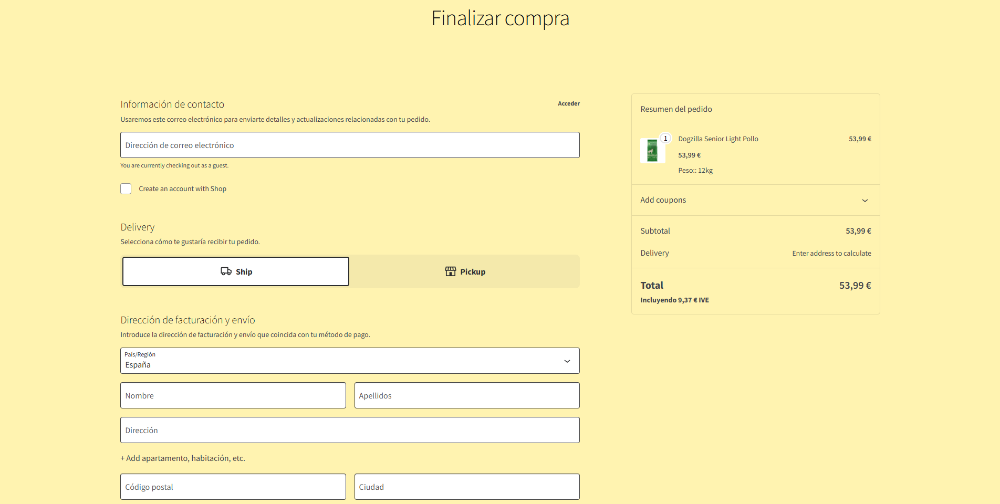
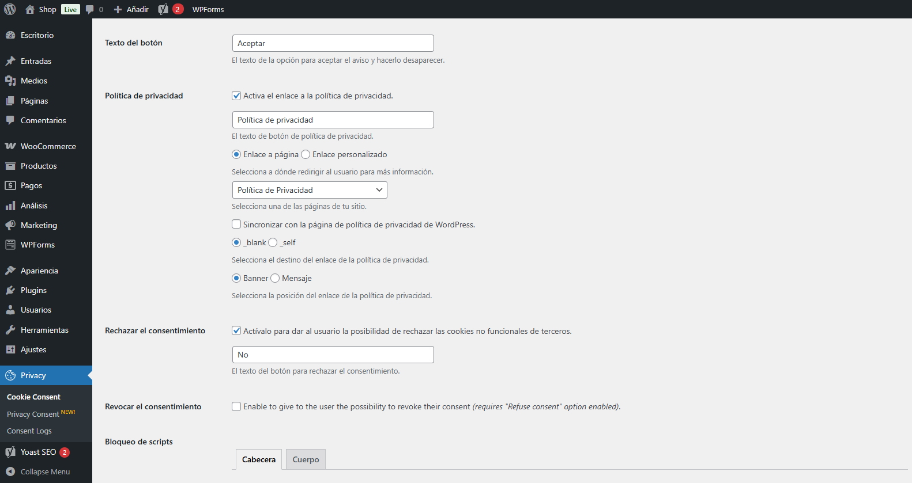
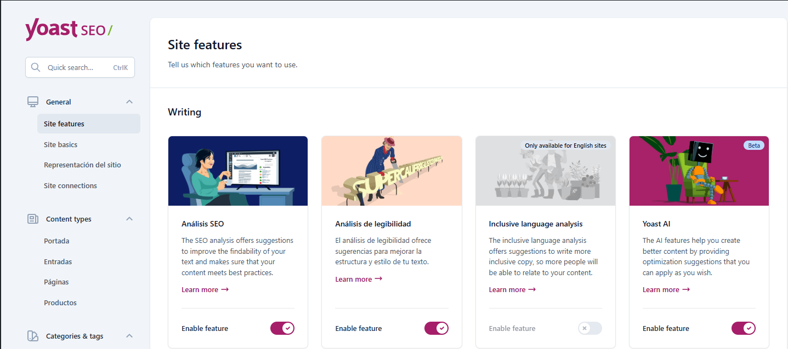
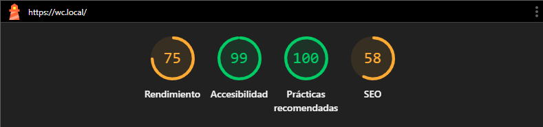

# Proyecto: Tienda de comida de animales

En este proyecto se realizo una tienda online para vender comida para las mascotas, inicialmente se realizo el cuerpo general de la página: inicio, tienda y página de contacto.

Luego con el plugin de WooCommerce configuramos para tener la página de tienda enlazada con WooCommerce, además de manera automatica crea las página de "carrito" y la configuración para el tema de los págos. Por mi parte le agregue los valores de IVE a la hora de calcular los precios.

Luego usamos el plugin "Cookie Notice & Compliance for GDPR/CCPA" para que al entrar en nuestra tienda online se vea y notifique a los usuarios de las Cookies.

Por ultimo agregamos el plugin de "Yoast SEO" para que nos ayude un poco con el tema de mejorar el SEO de nuestra tienda online. En este caso al ser un proyecto en local con varias limitaciones como bloquear los robots de google y prohibir la indexación de nuestra web a los buscadores, el SEO nos marca dichas faltas.

## Paleta de colores

- #335c67
- #fff3b0
- #e09f3e
- #9e2a2b
- #540b0e